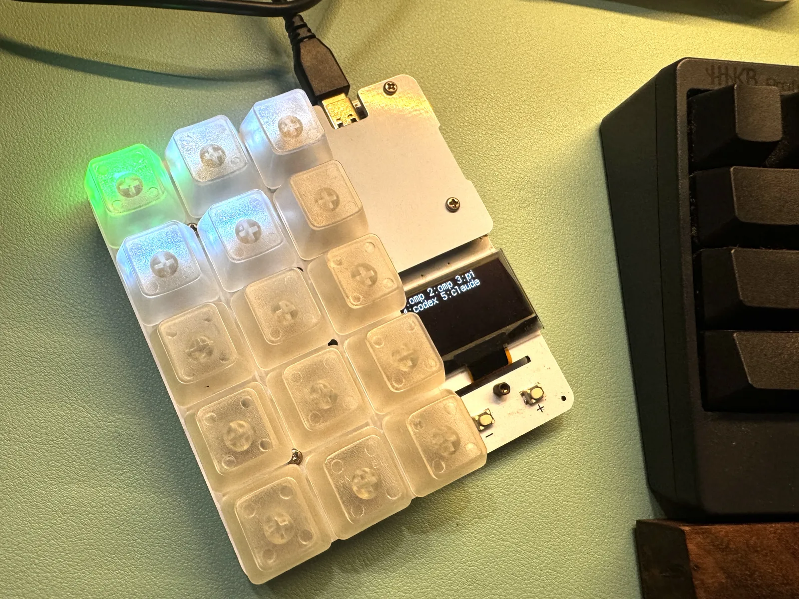

# duckyPad Herdr Bridge

> 繁體中文版 → [README.zh-TW.md](README.zh-TW.md)

A [herdr](https://herdr.dev) plugin that drives a **duckyPad** (STM32F072 EVO
macropad) from herdr's agent state.

- **N herdr agents → N lit keys.** Each of the pad's 15 NeoPixel keys represents
  one agent; the key's **color is that agent's state**.
- **Press a key → focus that agent's pane** in herdr.
- The pad's **OLED** shows a short list of the mapped agents.

No hardware changes. Everything on the pad side is firmware (the pad is a
custom-HID device, VID `0x483` / PID `0xd11c`); this plugin is a small Rust
daemon that talks to herdr's socket and to the pad.

The duckyPad set up as a herdr light board:



## States & colors (locked)

| state     | color          |
|-----------|----------------|
| `blocked` | red            |
| `working` | green          |
| `done`    | blue           |
| `unknown` | amber          |
| `idle`    | dim gray       |

With **more than 15 agents**, the first 15 in herdr's list order light
keys; overflow agents stay unlit until a slot frees.

## How it works

- **Firmware** (`../firmware/evo`): four custom-HID commands (`34` RGB
  frame, `35` OLED text, `36` herdr-mode on/off, `37` get key state). In
  "herdr mode" the 15 keys are suppressed from the normal keyboard report;
  on `37` the pad synchronously samples all switches and answers with a
  32-bit little-endian key-state bitfield in the custom IN report.
- **This daemon**: a 10ms main loop. It re-polls herdr's Unix socket with a
  one-shot `agent.list` every 2s (the socket handles **one request per
  connection**, so there is no persistent push subscription), keeps a
  picture of the agents, and on any change pushes the RGB frame + OLED text
  to the pad. On every tick it polls the pad's key state and edge-detects
  presses (a held key is latched, so it fires once per press); on a fresh
  press it issues a one-shot `agent.focus` for that agent's pane. Key
  assignment is sticky: an agent keeps its key for as long as it stays in
  the list (new agents take the next free key in list order), so keys don't
  jump around when states change or agents come and go.

## Requirements

- Rust toolchain (the `[[build]]` hook runs `cargo build --release`).
- `libhidapi` (the `hidapi` crate builds it; on Linux `libhidapi-hidraw` is
  used).
- herdr `>= 0.8.0` running (with its Unix socket), and the duckyPad flashed
  with the updated firmware and plugged in.

## Build

```bash
cd herdr-ducky-pad
cargo build --release
```

## Install (build + user service)

One script installs everything on both **Linux and macOS** — it builds
the daemon and runs it as a **user service** (systemd user unit on Linux,
launchd LaunchAgent on macOS; herdr's `[[startup]]` hooks are one-shot and
must exit, so a service is the right supervisor for a long-lived daemon):

```bash
./install.sh
```

It is idempotent — re-run it after pulling updates. It:

1. builds the daemon (`cargo build --release`);
2. registers the plugin with herdr (`herdr plugin link`, when herdr is on
   PATH);
3. installs and (re)starts the service:
   - **Linux**: `~/.config/systemd/user/ducky-pad-bridge.service`
   - **macOS**: `~/Library/LaunchAgents/com.botio.ducky-pad-bridge.plist`

Status & logs:

- **Linux**: `systemctl --user status ducky-pad-bridge`,
  `journalctl --user -u ducky-pad-bridge -f`
- **macOS**: `launchctl list | grep ducky-pad-bridge`,
  `tail -f /tmp/ducky-pad-bridge.log`

Manual install (no script): `cargo build --release`, then create and
enable the service file yourself — `install.sh` shows the exact
unit/plist contents.

## Test without the pad (dry run)

```bash
DUCKY_DRY_RUN=1 ./target/release/ducky-pad-bridge
```

The daemon still connects to herdr and logs every HID write it *would* send
(`DRYRUN OUT cmd=34 ...`), so you can watch the computed colors/OLED without
the physical device. If the pad isn't plugged in, the daemon also falls back
to dry run automatically.

## Building & flashing the firmware

The pad side is the stock duckyPad EVO firmware plus four herdr
custom-HID commands (`34` RGB frame, `35` OLED text, `36` herdr mode,
`37` key state).

**Flash it — no Keil, no toolchain needed.** A pre-built image of this
firmware, the **v3.1.0-herdr** build, ships in the repo. It was produced
with `arm-none-eabi-gcc`; the same build process has been proven to boot
and run on a real duckyPad. Hold the pad's `DFU` button while plugging it
in, then:

```bash
dfu-util --device 0483:df11 -a 0 -D ../firmware/duckypad_v3.1.0-herdr.dfu
```

The OLED boot screen shows `duckyPad V3.1.0` once it's running. The full
procedure (screenshots, and recovery by re-flashing the stock
`../firmware/duckypad_v3.0.4.dfu`) is in the main repo:
[`firmware_updates_and_version_history.md`](../firmware_updates_and_version_history.md).

In herdr mode the **SD card is not needed** — all display data comes over
USB HID; the microSD is only used by the stock duckyScript/profile
features.

**Rebuilding from source — only if you modify the C code.** Either:

- **Keil µVision** (ST ships a free MDK license for the STM32F072 "F0"
  parts): open `../firmware/evo/MDK-ARM/lul.uvprojx`, Rebuild (F7), and
  flash the Keil output the same way; or
- an `arm-none-eabi-gcc` cross build — the pre-built image in the repo was
  produced that way.
## End-to-end test (with the pad)

1. **Build & flash the firmware** (see [Building & flashing the firmware](#building--flashing-the-firmware) above).
2. **Plug in** the duckyPad (USB) and start **herdr** in a real session with a
   few agents.
3. **Start the daemon** — see
   [Install as a herdr plugin](#install-as-a-herdr-plugin) above; the daemon
   runs as a systemd user service:
   ```bash
   systemctl --user enable --now ducky-pad-bridge
   ```
4. **Observe:**
   - Each agent lights a key in its state color; when an agent moves to
     `blocked` it turns red, `working` green, `done` blue, `idle` dim.
   - The **OLED** lists the mapped agents (`1:name 2:name ...`).
   - **Press a key** → herdr focuses that agent's pane.

## Troubleshooting

- **No lights / no focus:** is the pad in "herdr mode"? The daemon sends
  `cmd 36` on start. Check `dmesg` / `lsusb` for the device (`483:d11c`), and
  that `libhidapi` can see it (permissions: add a udev rule or run as root).
- **`herdr not reachable` in the log:** herdr isn't running, or the socket
  path differs. Set `HERDR_SOCKET_PATH=/path/to/herdr.sock` if herdr uses a
  non-default path (e.g. a named session).
- **Logs:** set `RUST_LOG=debug` for more detail.

## The pad's protocol (reference)

- **OUT** (host → pad), report id `5`, 64-byte buffer:
  - `[0]=5, [1]=0, [2]=cmd`
  - `cmd 34` (RGB): `[3..47]` = 15 × `(R,G,B)`, key order.
  - `cmd 35` (OLED): `[3]=len(≤56), [4..]` = UTF-8 text (`\n` = new line).
  - `cmd 36` (mode): `[3]=1` enter herdr mode, `0` leave.
  - `cmd 37` (key state): no payload; the pad samples all switches and
    answers with the IN report below.
- **IN** (pad → host), report id `4`: the key-state answer to `37` is
  `[0]=4, [1]=0xF1, [2]=0 (OK), [3..7]` = 32-bit little-endian bitfield,
  bit `n` (0-based) set = key `n+1` physically pressed. The daemon reads
  the low 15 bits (the 15 agent keys) and edge-detects on them.
